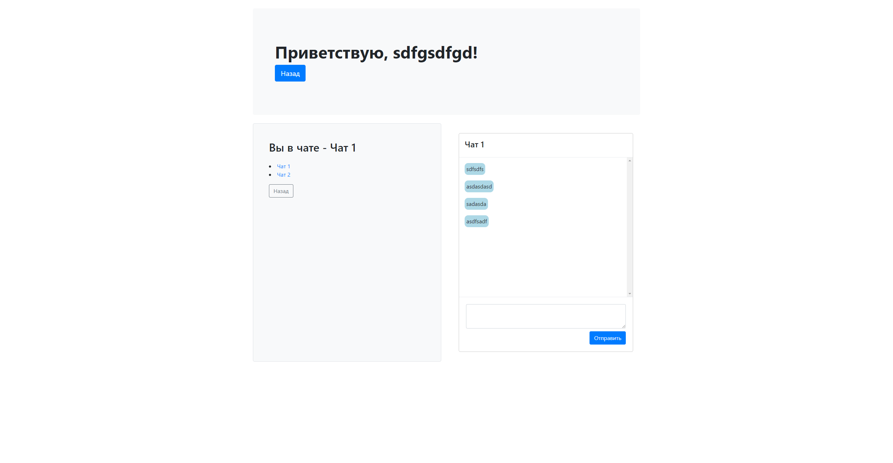
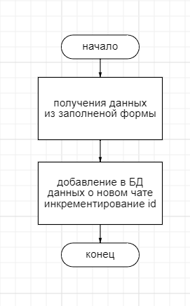
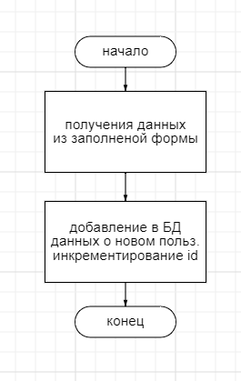

# Отчёт о L3
#### *По курсу "Основы Программирования"*
#### *Работу выполнил студент группы №3131 Тихомиров Н.А.*

## Изучение предметной области

Разработать и реализовать анонимный чат с возможностью создания каналов. В интерфейсе отображается список каналов, пользователь может либо подключиться к существующему каналу, либо создать новый. Сообщения доставляются пользователю без обновления страницы.

## Составление ТЗ

- Базовая система добавления каналов/новых пользователей
- Базовая система общения в чате

## Выбор технологий

#### *Среда разработки:*
Sublime Text 3.

#### *Языки программирования:*
PHP, HTML.

## Реализация

### Пользовательский интерфейс:
- *Главное меню:*                                                                                           
  

### Пользовательский сценарий:

Пользователь заходит на сайт, сразу же попадает на главную страницу с меню *(index.php)*. Пользователь выбирает зарегистрировать нового пользователи или создать новый канал. Создавая нового пользователя он попадает на *(signin.php)*. Создавая новый канал пользователь обращается к (addChat.php)*.
После попадания в чат сообщения, отправленные пользователем обрабатываются каждые 0.1 сек.

### Хореография

При отправке сообщения используется ajax. Страница не обновляется, данные о сообщении добавляются в БД. После добавления в БД сообщение выводится в чате.

При создании нового пользователя данные из формы переносятся в БД, после чего пользователь может зайти в чат под новым именем.

### Структура базы данных

Браузерное приложение phpMyAdmin используется для просмотра содержимого базы данных. Всего 3 таблицы:

Первая таблица для хранения данных о пользователях:
1. "id" типа int с автоинкрементом для выдачи уникальных id всем пользователям
2. "username" типа varchar для хранения имени пользователя

Вторая таблица для хранения данных о чатах:
1. "id" типа int с автоинкрементом для выдачи уникальных id чатам
2. "chat" типа varchar для хранения названия чатов

Третья таблица для хранения данных о сообщениях:
1. "id" типа int с автоинкрементом для выдачи уникальных id всем сообщения
2. "from_user" типа int для хранения id отправителя
3. "to_chat" типа int для хранения id чата
4. "mess" типа varchar для хранения текста сообщения

### Алгоритмы
1. Алгоритм создания чата             

2. Алгоритм создания пользователя                                                                      

